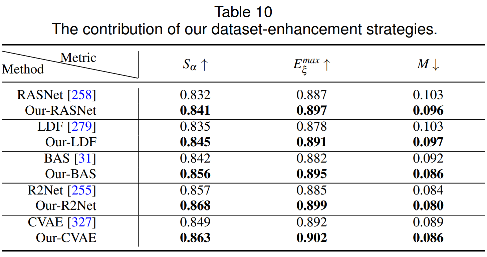
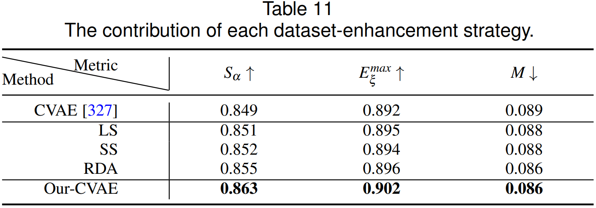

# SOC-DataAug

This repo contains the data augmentation part used in [Salient Objects in Clutter](https://arxiv.org/pdf/2105.03053.pdf).

You can adapt the settings in `config.py` for your own trials.

> In this document, we investigate three dataset-enhancement strategies (DES), including label smoothing to implicitly emphasize salient boundaries, random image augmentation to adapt saliency models to various scenarios, and self-supervised learning as a regularization strategy to learn from small datasets.

Despite the apparent simplicity of our strategies, we can achieve an average absolute improvement of 1.1% Sα over five existing cutting-edge models:



Further, we investigate the contribution of each data-enhancement strategy, and show the performance in Table 11, where we choose [CVAE](https://arxiv.org/abs/2009.03075) as the base model. “LS”, “RDA”, “SS” represent adding **label smoothing strategy**, **random data augmentation** and **self-supervised learning** to the base model respectively.



+ **Random data augmentation** introduced diverse samples to the initial training dataset, which is effective in improving model <u>generalization ability</u>.
+ **Self-supervised learning strategy** was inspired by the multi-scale input strategy used in [CVAE](https://arxiv.org/abs/2009.03075). We utilized it as a <u>regularization</u> technique and observed slightly improved performance.
+ **Label smoothing**  was introduced to <u>prevent model from over-confidence</u>, thus achieve well-calibrated model.


```
@article{Fan2021SOC,
title={Salient Objects in Clutter},
author={Fan, Deng-Ping and Zhang, Jing and Xu, Gang and Cheng, Ming-Ming and Shao, Ling},
journal={arXiv preprint arXiv:2105.03053},
year={2021}
}
```